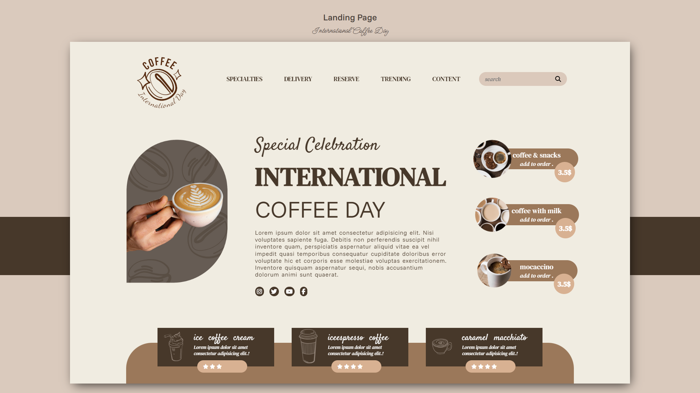

# ☕ Coffee Shop Landing Page  

A simple and elegant **Coffee Shop Landing Page** built with **HTML, CSS, and a little JavaScript**.  
This project is focused on practicing **layout design, hover effects, and UI styling**.  

---

## 🚀 Features  
- Clean and modern coffee shop landing page design.  
- Hover effects for interactive elements.  
- Organized layout with main container design.  
- Basic responsive preparation (PC-first).  
- Ready to deploy on **GitHub Pages**.  

---

## 📸 Preview  
    

---

## 🛠️ Technologies Used  
- **HTML5** – for structure  
- **CSS3** – for styling and hover effects  
- **JavaScript (vanilla)** – for simple interactions (like menu toggle)  

---

---

## 🌐 Live Demo  
👉 [View on GitHub Pages](https://sinaprj-web.github.io/Coffee-shop-Landing-Page/)  

---

## 📖 Lessons Learned  
- Practiced **box-shadow, positioning, and container layouts**.  
- Learned how to set up **hover effects** for buttons and menus.  
- Improved understanding of **project structuring** before moving to responsive design.  

---

## 🔮 Next Steps  
- Add full **mobile responsiveness** with media queries.  
- Improve the **hamburger menu** for smaller screens.  
- Try adding **animations** for a smoother user experience.  

---

## 👨‍💻 Author  
**Sina Pourrajabi**  
- GitHub: [@SinaPrj-web](https://github.com/SinaPrj-web)  

